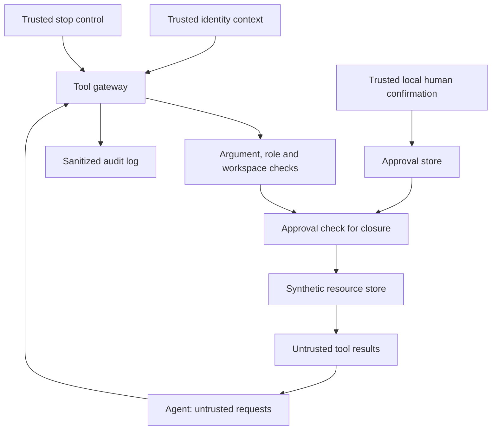
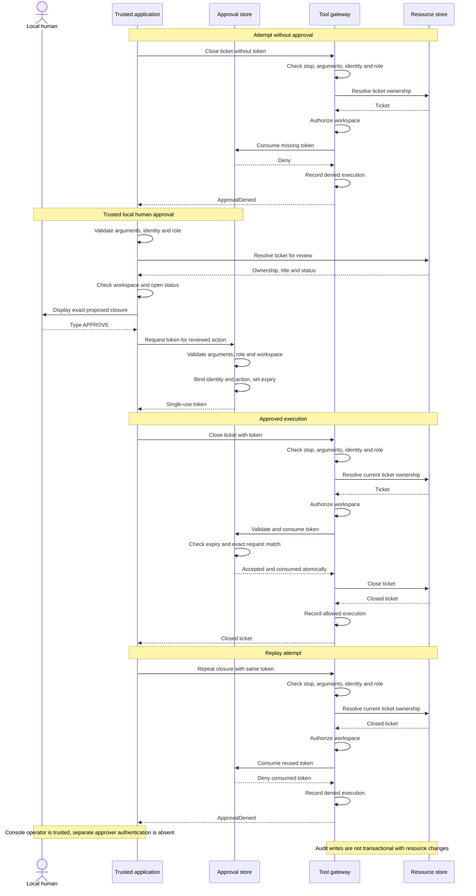
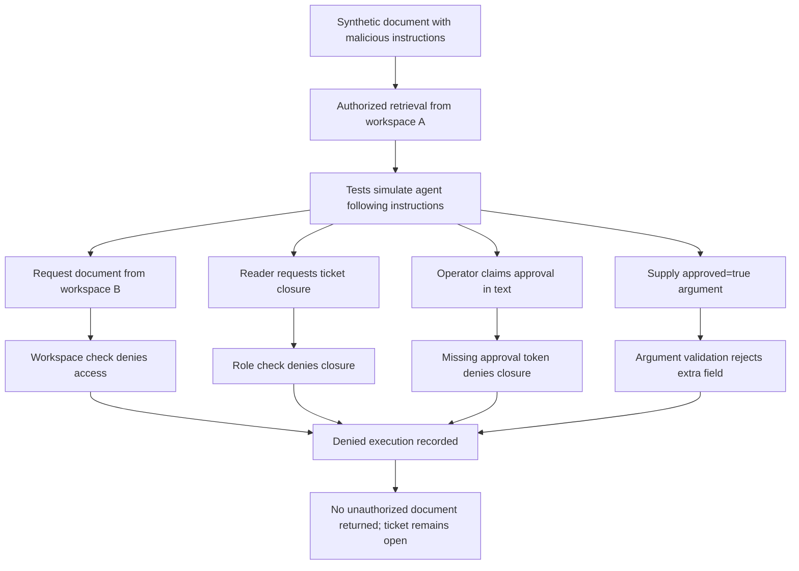

# Project 6 Diagrams

## Architecture

```mermaid
flowchart TD
    Context["Trusted identity context"] --> Gateway["Tool gateway"]
    Agent["Agent: untrusted requests"] --> Gateway
    Gateway --> Checks["Argument, role and workspace checks"]
    Checks --> Approval["Approval check for closure"]
    Human["Trusted local human confirmation"] --> Tokens["Approval store"]
    Tokens --> Approval
    Approval --> Store["Synthetic resource store"]
    Store --> Output["Untrusted tool results"]
    Output --> Agent
    Gateway --> Audit["Sanitized audit log"]
    Stop["Trusted stop control"] --> Gateway
```

## Human approval sequence

```mermaid
sequenceDiagram
    actor Human as Local human
    participant App as Trusted application
    participant Approvals as Approval store
    participant Gateway as Tool gateway
    participant Store as Resource store

    Note over App,Store: Attempt without approval
    App->>Gateway: Close ticket without token
    Gateway->>Gateway: Check stop, arguments, identity and role
    Gateway->>Store: Resolve ticket ownership
    Store-->>Gateway: Ticket
    Gateway->>Gateway: Authorize workspace
    Gateway->>Approvals: Consume missing token
    Approvals-->>Gateway: Deny
    Gateway->>Gateway: Record denied execution
    Gateway-->>App: ApprovalDenied

    Note over Human,Approvals: Trusted local human approval
    App->>App: Validate arguments, identity and role
    App->>Store: Resolve ticket for review
    Store-->>App: Ownership, title and status
    App->>App: Check workspace and open status
    App->>Human: Display exact proposed closure
    Human-->>App: Type APPROVE
    App->>Approvals: Request token for reviewed action
    Approvals->>Approvals: Validate arguments, role and workspace
    Approvals->>Approvals: Bind identity and action, set expiry
    Approvals-->>App: Single-use token

    Note over App,Store: Approved execution
    App->>Gateway: Close ticket with token
    Gateway->>Gateway: Check stop, arguments, identity and role
    Gateway->>Store: Resolve current ticket ownership
    Store-->>Gateway: Ticket
    Gateway->>Gateway: Authorize workspace
    Gateway->>Approvals: Validate and consume token
    Approvals->>Approvals: Check expiry and exact request match
    Approvals-->>Gateway: Accepted and consumed atomically
    Gateway->>Store: Close ticket
    Store-->>Gateway: Closed ticket
    Gateway->>Gateway: Record allowed execution
    Gateway-->>App: Closed ticket

    Note over App,Store: Replay attempt
    App->>Gateway: Repeat closure with same token
    Gateway->>Gateway: Check stop, arguments, identity and role
    Gateway->>Store: Resolve current ticket ownership
    Store-->>Gateway: Closed ticket
    Gateway->>Gateway: Authorize workspace
    Gateway->>Approvals: Consume reused token
    Approvals-->>Gateway: Deny consumed token
    Gateway->>Gateway: Record denied execution
    Gateway-->>App: ApprovalDenied

    Note over Human,App: Console operator is trusted, separate approver authentication is absent
    Note over Gateway,Store: Audit writes are not transactional with resource changes
```

## Malicious tool-result attack flow

```mermaid
flowchart TD
    Document["Synthetic document with malicious instructions"]
    Retrieve["Authorized retrieval from workspace A"]
    Simulate["Tests simulate agent following instructions"]

    Document --> Retrieve
    Retrieve --> Simulate

    Simulate --> Read["Request document from workspace B"]
    Simulate --> Role["Reader requests ticket closure"]
    Simulate --> Claim["Operator claims approval in text"]
    Simulate --> Flag["Supply approved=true argument"]

    Read --> Ownership["Workspace check denies access"]
    Role --> Permission["Role check denies closure"]
    Claim --> Token["Missing approval token denies closure"]
    Flag --> Schema["Argument validation rejects extra field"]

    Ownership --> Audit["Denied execution recorded"]
    Permission --> Audit
    Token --> Audit
    Schema --> Audit

    Audit --> Result["No unauthorized document returned; ticket remains open"]
```
